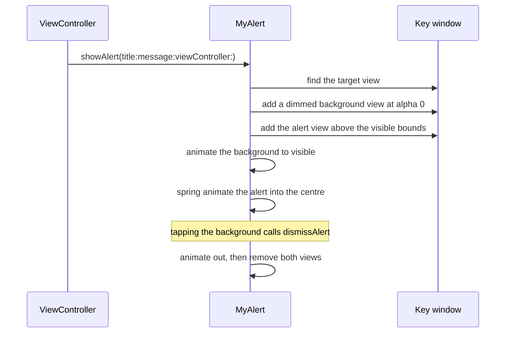

# Custom Alert

*An alert built from scratch, presented over the key window.*

    

## Overview

`UIAlertController` cannot be restyled. When a design calls for a branded dialog the alert has to be built and presented manually, which means finding the right window, dimming the background, animating in and cleaning up afterwards.

## How it works



## Implementation notes

- **Constants in one struct.** Sizes, corner radius and animation durations live in a nested `Constants` type, so the dialog is resized in one place.
- **Presented on the window, not the controller.** Adding to the window keeps the alert above navigation bars and tab bars without any presentation context work.
- **Two phase animation.** The background fades while the panel springs in, which reads as one motion rather than two.
- **Views removed after dismissal.** The completion of the exit animation removes both views, so repeated presentations do not stack invisible layers.

## Project structure

```
Custom Alert/
├── MyAlert.swift          the alert type and its animation
└── ViewController.swift
```

## Requirements

Xcode 15 or later, iOS 17.5 or later. No external dependencies.
